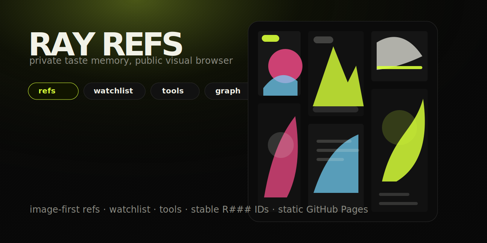

# Ray Refs

[](https://raysvitla.github.io/refs/)
[](https://github.com/raysvitla/refs)



A public, static visual browser for a private taste-memory system.

Ray Refs is an are.na-ish board for keeping reference images, screenshots, watchlist items, and taste evidence in one compact place. It is deliberately image-first: quiet metadata, stable `R###` IDs, no social-feed sludge.

**Open it:** https://raysvitla.github.io/refs/

## What is inside

- **Refs grid** — compact masonry board for visual references.
- **Watchlist** — films, anime, series, games, books, and other “check later” drops.
- **Taste graph** — interactive map of refs, tags, and collections.
- **Stable IDs** — every item gets a copyable `R###` code for future prompts and reviews.
- **Static deploy** — no backend, no account, no tracking layer; just HTML and assets.

## Why this exists

Most personal reference boards rot into folders called `inspo_final_2`. This one keeps the useful bits:

- the original image/file,
- collection and tag context,
- aesthetic signals,
- short “why it hits” notes,
- a fast public browser for phone/laptop use.

It is less “portfolio” and more **taste memory**: evidence for future design, writing, product, music, and visual work.

## Repository shape

This repo is the **public static mirror** only.

```text
index.html                  # generated live browser
assets/ray-refs-preview.svg # README preview graphic
assets/originals/...        # public-safe archived refs
```

The canonical source/generator lives in a private repo so personal notes and raw intake context do not leak. Sensible boundary, not secrecy theatre.

## Notes on media

The board contains reference material, screenshots, and images preserved for personal taste research. Media rights remain with their original creators/rightsholders. If something here is yours and you want it removed, open an issue or ping Ray.

## Build your own

Steal the pattern:

1. keep originals,
2. assign stable IDs,
3. write useful tags instead of vibeslop,
4. generate a static board,
5. keep private notes private,
6. publish only the clean mirror.

That is the whole trick. Annoyingly effective.
